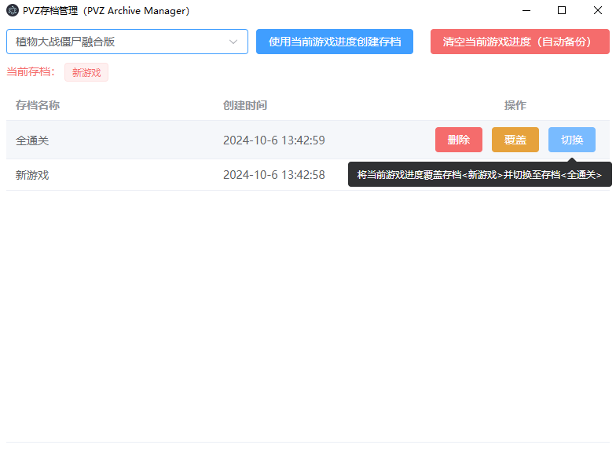
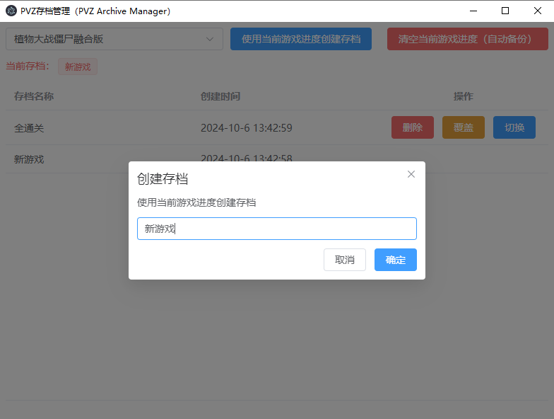
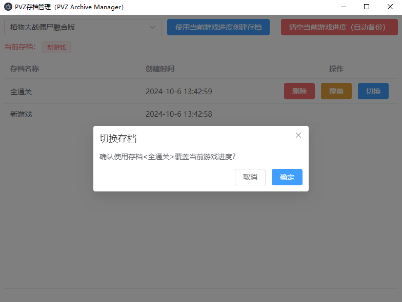

# PVZ 存档管理器（PVZ Archive Manager）

该版本基于 Electron 构建，后续会使用 Tauri 并尝试开发移动端版本。

## 功能

- [x] 使用当前游戏进度创建存档。
- [x] 使用当前游戏进度覆盖存档。
- [x] 删除存档。
- [x] 切换存档。
- [x] Windows 版本。
- [ ] Android 版本。
- [ ] 备份到云端。
- [ ] 同步 Windows 与 Android 的游戏进度。

## 代码仓库

### gitee

[代码仓库](https://gitee.com/xclhove/pvz-archive-manager-electron)

[下载地址（国内）](https://gitee.com/xclhove/pvz-archive-manager-electron/releases)

### github

[代码仓库](https://github.com/XCLHove/pvz-archive-manager-electron)

[下载地址](https://github.com/XCLHove/pvz-archive-manager-electron/releases)

## 功能展示

